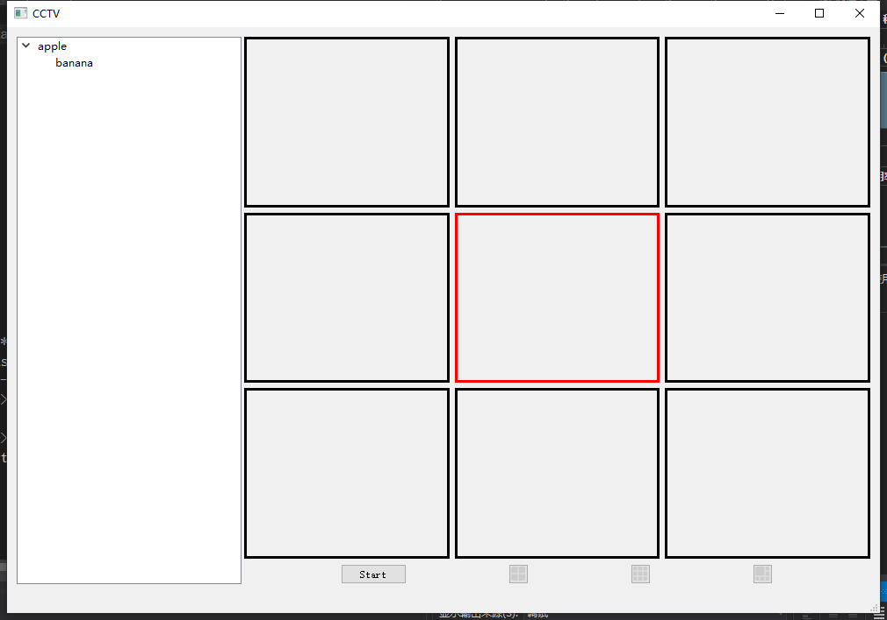

# CCTV Widget

This QT5 widget uses mouse movements, signal feature and RTSP protocol with Enzhi local cameras.

# Features

This widget consists of two major parts, the left side is a leveled tree which is intended to show levels of camera systems. The right side widget is the major part, which uses RTSP to call a local camera under Enzhi's protocol and real time displays it on screen. 

The camera viewers can be dragged (shown in red blocks), and different options of viewers(4, 9, 6 viewers) are implemented in function of qButtons.

